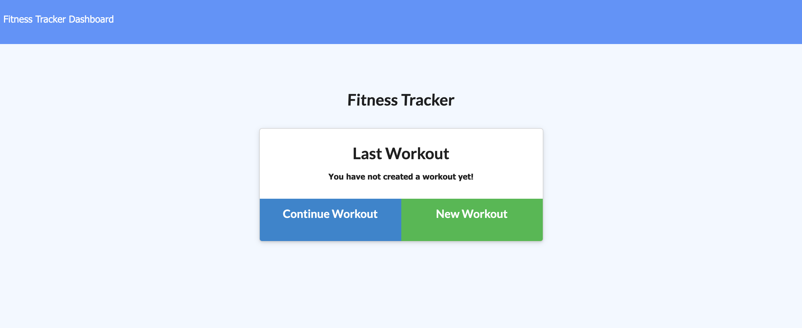
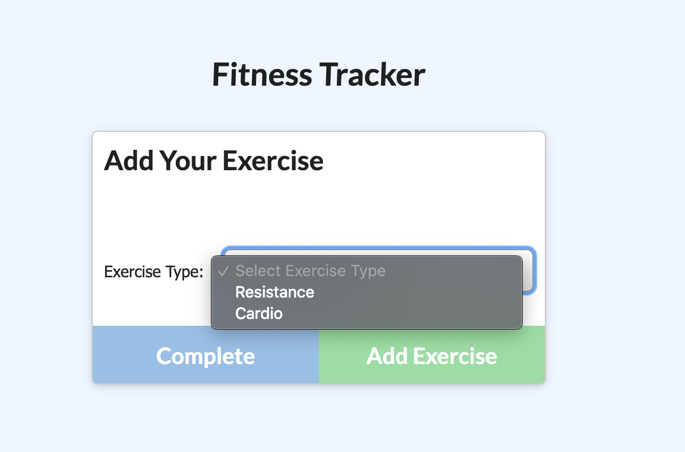
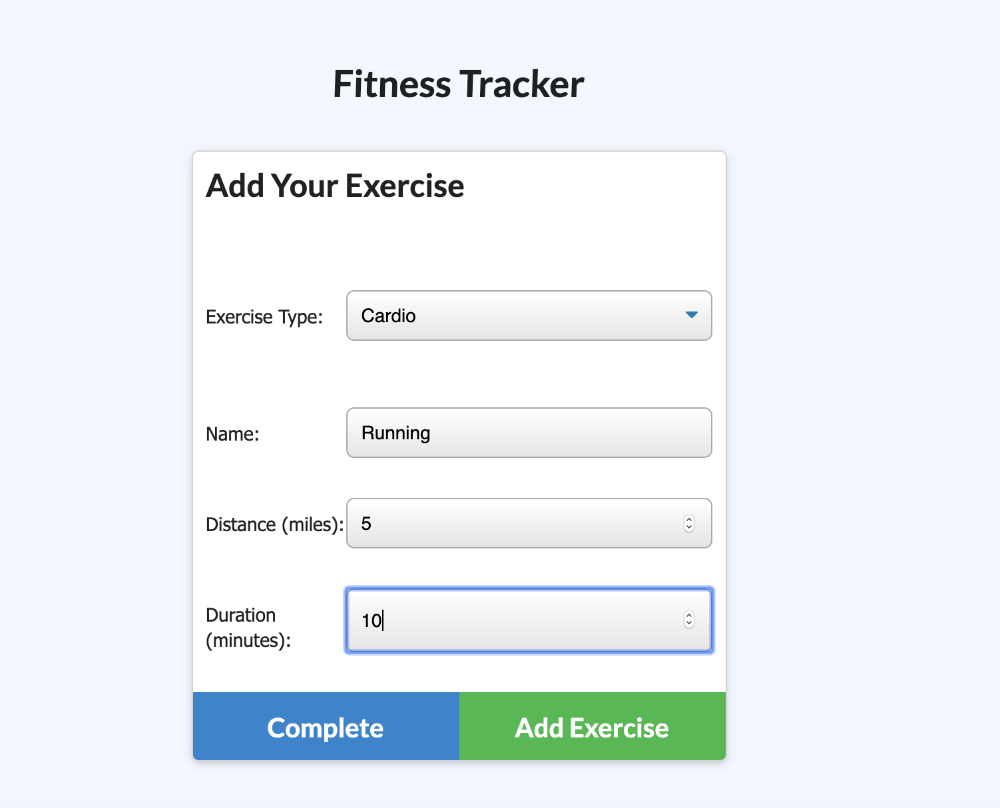
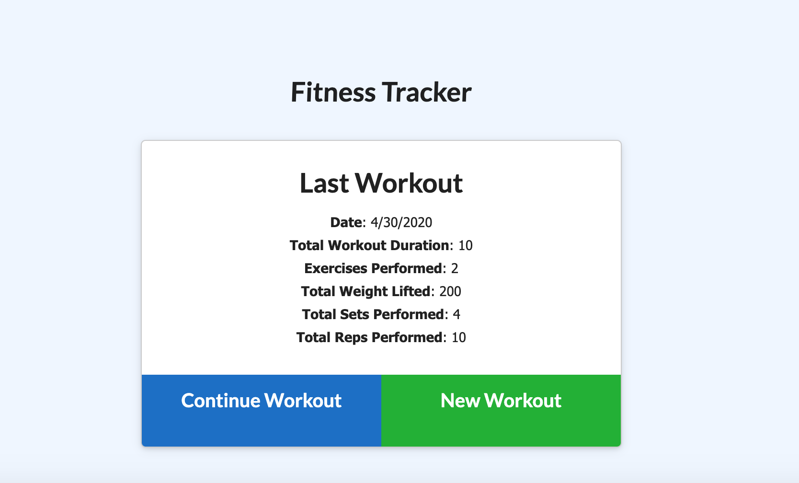
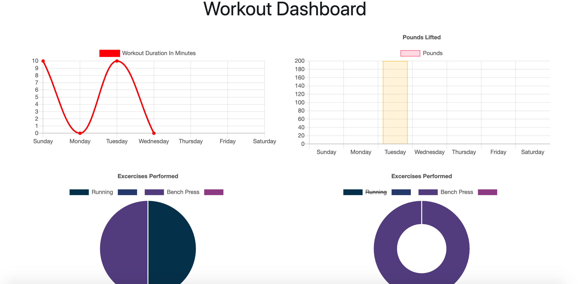

# Workout Tracker

## Description 
An app that allows the user to view, create, and track daily workouts and be able to log multiple exercises in a workout on a given day

## Table of contents
* [Installation](#installation)
* [Usage](#usage)
* [Contributing](#contributing)
* [Questions](#questions)

## Installation
To install necessary dependencies, run the following command:
npm install

## Usage
When you first visit the site, you will be taken to the homepage that will prompt the user to create a new workout

When the user clicks on the "New Workout" button, they will be able to choose the exercise type from a dropdown and will be given 2 options: Resistance or Cardio. 

Once the user has selected the exercise type, they will be prompted to ask a series of questions specific to the type. The user can click on the "Add Exercise" button to add to the database and the complete button will redirect the user to the homepage.

After the user has added the exercise, the workout summary on the homepage will update with the new information.

When the user clicks on the "Dashboard" in the nav bar, then a series of graphs and tables will be displayed to show the user their stats.

## Contributing 
If you would like to make changes please include a description and images of the feature with a pull request

## Questions

If you have any questions about the repo, open an issue or contact  directly at sylhuynh76@gmail.com

